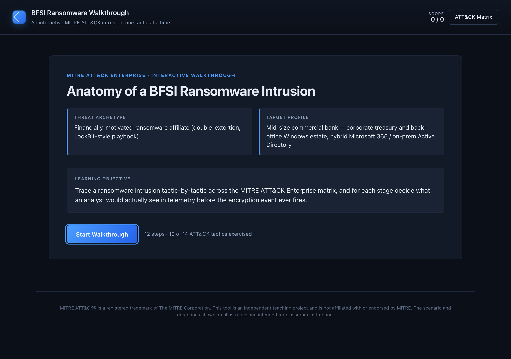
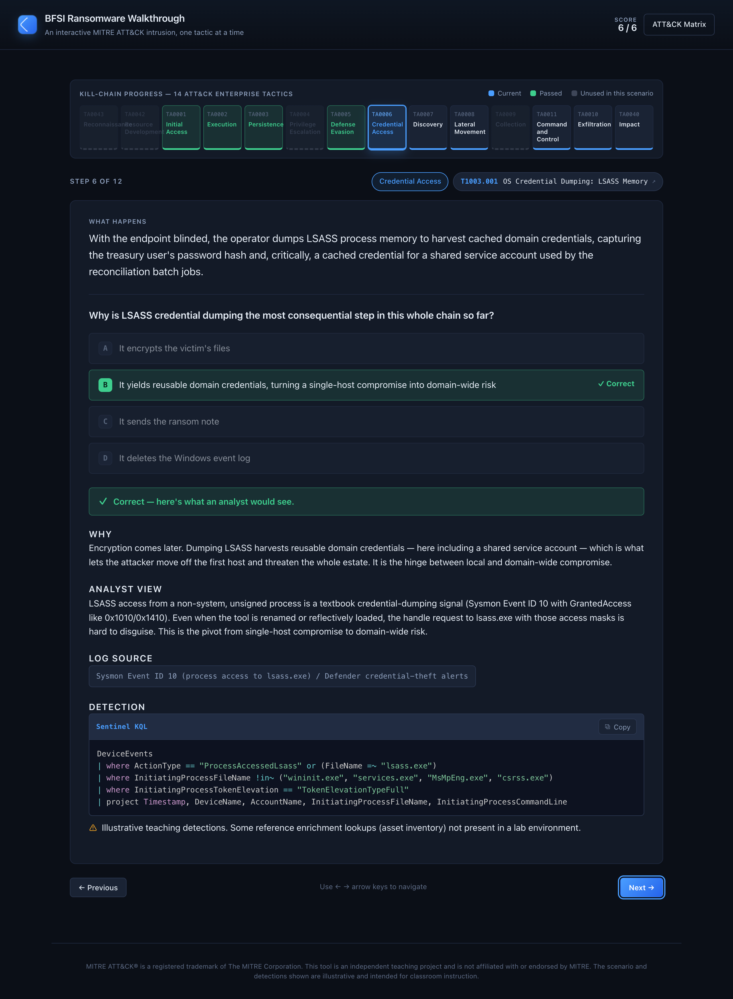
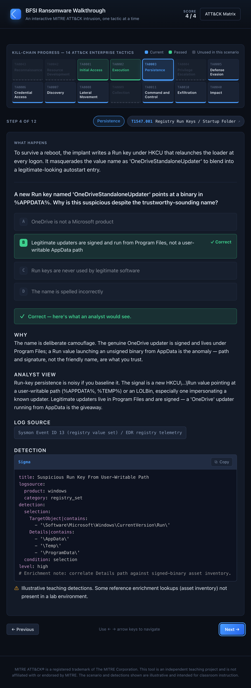

# BFSI Ransomware Walkthrough — Interactive ATT&CK Teaching Tool

**▶ Live demo: https://sai-teja-girimaji.github.io/bfsi-ransomware-walkthrough/**

A static, single-page interactive teaching tool that walks students through a
BFSI (banking / financial services) ransomware intrusion **one MITRE ATT&CK
tactic at a time**. Built for classroom / projector use: answer a question at
each stage *before* the analyst view and detection logic are revealed.

**No build step. No backend. No dependencies to install.** Plain HTML / CSS / JS.
The only external resource is [Prism.js](https://prismjs.com/) via CDN for
syntax-highlighting the detection queries.

**Landing view** — scenario briefing and entry point:



**Step view** (step 6) — the kill-chain tactics bar shows passed tactics in green, the current tactic (Credential Access) highlighted, and unused tactics greyed; below, an answered quiz reveals the analyst view, log source, and a syntax-highlighted Sentinel KQL detection:



**Tablet / responsive** (768px wide) — the 14-tactic bar reflows to two rows and the layout stacks for narrower screens, down to tablet width:

<p align="center"></p>

## Run locally

Browsers block `fetch()` on `file://` URLs, so serve the folder over HTTP:

```bash
python3 -m http.server 8000
# then open http://localhost:8000/
```

## How it works

- **`index.html`** — shell: header, footer, Prism CDN links, and an `#app` mount point.
- **`styles.css`** — design tokens + all view styles. Palette, fonts, radii and
  header/footer pattern are inherited from the author's other ATT&CK portfolio tool.
- **`app.js`** — fetches the scenario at runtime, holds all state in memory (a plain
  state object — no `localStorage`/`sessionStorage`, resets on reload), and renders
  three views: landing → 12-step stepper → closing summary.
- **`attack-scenario-bfsi-ransomware.json`** — **the only file you edit to change the
  lesson.** Scenario metadata, a 14-tactic legend, 12 steps (narrative, tactic,
  technique, analyst view, log source, detection query, and a gated quiz), and a
  closing summary. Swap in a new scenario by replacing this file — no code changes.

## Design intent

- **Quiz gate:** on each step the question comes first. The analyst view, log source
  and detection block stay hidden until the student commits to an answer. Next is
  disabled until then.
- **Unused tactics stay visible and greyed.** This scenario exercises 10 of the 14
  ATT&CK Enterprise tactics; the other 4 are deliberately shown greyed-out, not
  hidden — coverage is scenario-specific and that contrast is the point.
- **Detections are illustrative teaching queries**, shown read-only with a copy
  button and a standing disclaimer. They are not drop-in production rules.

## Accessibility

- Keyboard navigable: `←` / `→` move between steps, `1`–`4` select answers, `Enter`
  starts the walkthrough, quiz options are focusable buttons.
- Correct / incorrect is never signalled by colour alone — an icon and text label
  accompany every state.
- Responsive down to tablet width; type sized for projector legibility.

---

MITRE ATT&CK® is a registered trademark of The MITRE Corporation. This is an
independent teaching project, not affiliated with or endorsed by MITRE. The
scenario and detections are illustrative and intended for instruction.
